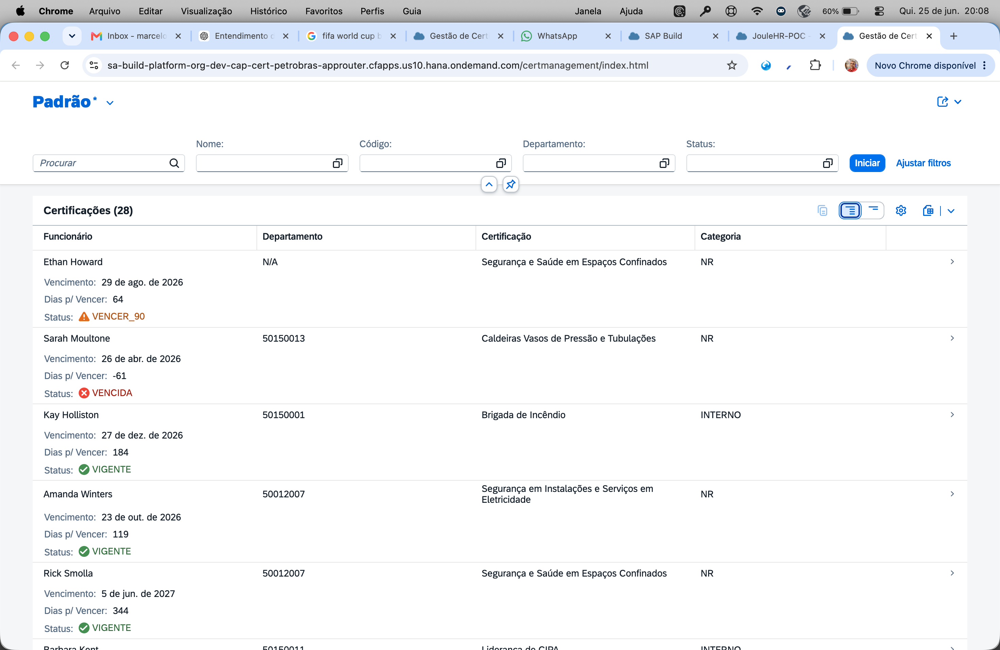
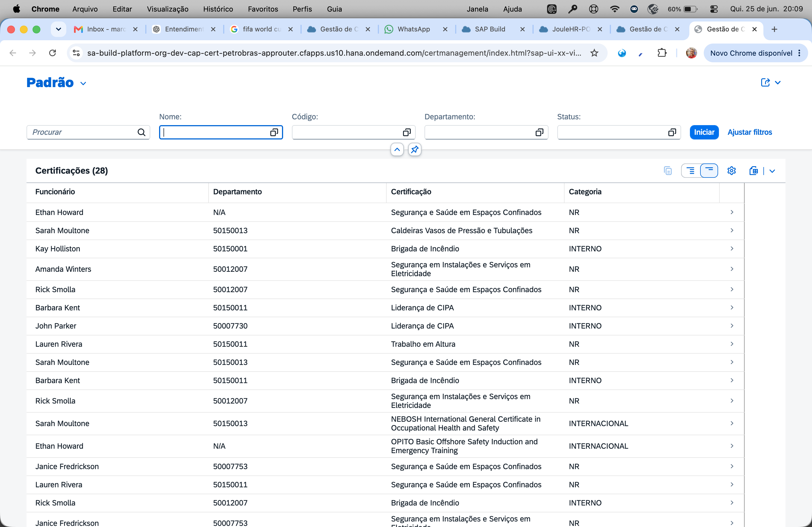
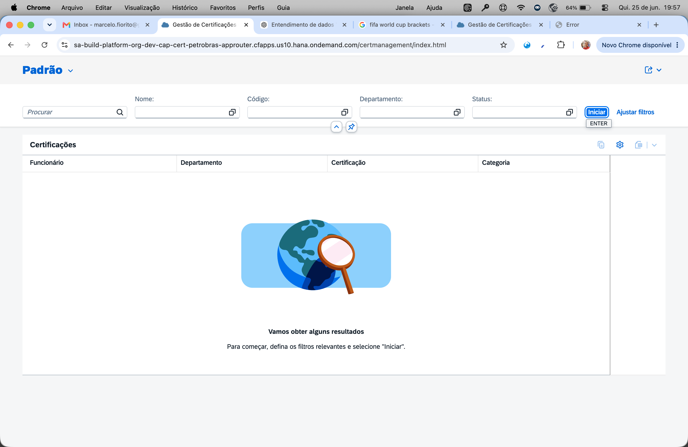

# Gestão de Certificações O&G — SAP SuccessFactors Extension

> **Extensão SAP CAP** para controle de habilitações técnicas obrigatórias em empresas do setor de Óleo & Gás, integrada ao SAP SuccessFactors via OData API.  
> Versão `1.0.0` · Deploy: SAP BTP Cloud Foundry · Interface: SAP Fiori Elements

---

## 🔗 Acesso Rápido — Ambiente de Demonstração

| | URL |
|---|---|
| **Interface Fiori (App)** | https://{{APPROUTER_HOST}}/certmanagement/index.html |
| **OData API** | https://{{SRV_HOST}}/CertService |
| **Health Check** | https://{{SRV_HOST}}/health |
| **Metadata OData** | https://{{SRV_HOST}}/CertService/$metadata |

> ⚠️ Autenticação via SAP BTP XSUAA — necessário login com conta BTP do subaccount `build-platform-rfm61ms1` (US10).

---

## Descrição de Negócio

### O Problema

Empresas de Óleo & Gás como a Petrobras têm **obrigação regulatória e operacional** de manter seus colaboradores com as certificações técnicas em dia. Uma NR-33 (Espaço Confinado) vencida não é apenas uma infração trabalhista — é um risco real de acidente grave ou fatal.

O SAP SuccessFactors, na sua configuração padrão, **não possui uma entidade nativa para controle de certificações técnicas** (NRs, OPITO, NEBOSH etc.). Cada empresa gerencia isso em planilhas Excel, sistemas legados desconectados ou processos manuais, gerando:

- **Risco de compliance**: funcionários atuando com certificações vencidas
- **Retrabalho operacional**: renovações emergenciais por falta de controle preventivo
- **Invisibilidade para a liderança**: impossibilidade de saber o status de certificações da equipe em tempo real
- **Desconexão com o RH**: dados de certificação isolados do perfil do colaborador no SFSF

### A Solução

Esta extensão CAP cria uma **camada de dados integrada ao SuccessFactors** que:

1. **Armazena certificações técnicas** diretamente no SAP HANA Cloud, vinculadas ao `userId` do SFSF
2. **Calcula automaticamente o status** de cada habilitação em tempo real (Vigente / A Vencer / Vencida)
3. **Exibe alertas visuais** por criticidade — vermelho (vencida), laranja (vencendo em breve), verde (em dia)
4. **Integra ao ecossistema SAP** via OData V4, consumível por Joule, Fiori e APIs REST
5. **Alimenta o agente Joule** com 3 novas ferramentas conversacionais de RH

### Quem Usa e Como

| Perfil | Necessidade | O que a aplicação entrega |
|---|---|---|
| **Gestor de área** | Saber quem da equipe tem certificação vencida antes de escalar para atividade de risco | Dashboard por departamento com lista de pendências críticas |
| **Técnico de SMS** | Controlar vencimentos e acionar renovações com antecedência de 30/90 dias | Lista filtrada por status + alertas automáticos |
| **Analista de RH** | Incluir certificações no processo de avaliação de compliance dos colaboradores | Histórico de habilitações vinculado ao perfil SFSF |
| **Colaborador** | Saber quais certificações precisa renovar e quando | Consulta via Joule conversacional |

---

## Tipos de Certificação Suportados

| Código | Nome | Categoria | Validade | Obrigatória Para |
|---|---|---|---|---|
| `NR-10` | Segurança em Instalações Elétricas | NR | 24 meses | E&P, Refinaria, Manutenção |
| `NR-13` | Caldeiras, Vasos de Pressão e Tubulações | NR | 24 meses | Refinaria, Operações |
| `NR-33` | Segurança em Espaços Confinados | NR | 12 meses | E&P, Refinaria, SMS |
| `NR-35` | Trabalho em Altura | NR | 12 meses | E&P, Engenharia, Manutenção |
| `NEBOSH-IGC` | NEBOSH International General Certificate | Internacional | 36 meses | SMS, HSSE, Gestão de Riscos |
| `OPITO-BOSIET` | Basic Offshore Safety & Emergency Training | Internacional | 48 meses | E&P Offshore, Plataformas |
| `HUET` | Helicopter Underwater Escape Training | Internacional | 48 meses | E&P Offshore, Logística |
| `STCW-BST` | STCW Basic Safety Training | Internacional | 60 meses | Logística Naval |
| `CIPA-LIDER` | Liderança de CIPA | Interno | 12 meses | Todos |
| `BRIGADA-INCENDIO` | Brigada de Incêndio | Interno | 12 meses | SMS, Facilities |
| `PRTP` | Plano de Resposta a Emergências Petrobras | Interno | 12 meses | Operações, E&P |

---

## Interface — Fiori Elements

### Tela 1: List Report — Visão Geral de Certificações



A tela principal exibe **todas as habilitações** dos colaboradores com carregamento automático ao abrir. Cada linha mostra:

- **Funcionário** — nome vinculado ao perfil SAP SuccessFactors
- **Departamento** — código do departamento (ex: `50150013` = Quality Assurance US)
- **Certificação** — nome completo da habilitação técnica
- **Categoria** — NR (Norma Regulamentadora) / Internacional / Interno
- **Vencimento** — data de expiração
- **Dias p/ Vencer** — contador em dias (negativo = já vencida)
- **Status** — indicador colorido automático:
  - 🔴 **VENCIDA** — habilitação expirada, colaborador impedido de atuar
  - 🟡 **VENCER_30** — vence em até 30 dias, ação urgente necessária
  - 🟠 **VENCER_90** — vence entre 31 e 90 dias, planejar renovação
  - 🟢 **VIGENTE** — habilitação válida, sem pendências

**Filtros disponíveis:** Nome do funcionário · Código da certificação · Departamento · Status

### Tela 2: Barra de Filtros e Pesquisa



O List Report possui filtros rápidos na barra superior permitindo localizar certificações por qualquer combinação de critérios. O botão **"Ajustar filtros"** expande opções adicionais.

### Tela 3: Tela Inicial (sem filtro ativo)



Comportamento padrão do SAP Fiori List Report — carregamento automático ativado por padrão (`initialLoad: true` no manifest). Os dados são carregados imediatamente ao abrir a aplicação, sem necessidade de clicar em "Iniciar".

---

## Arquitetura Técnica

```
┌─────────────────────────────────────────────────────────────────┐
│                     SAP BTP (Cloud Foundry)                     │
│                                                                  │
│  ┌─────────────────┐    ┌──────────────────┐    ┌────────────┐  │
│  │   App Router    │───▶│   CAP Node.js    │───▶│ HANA Cloud │  │
│  │ (Fiori + Auth)  │    │  (OData V4 API)  │    │ (HDI cont) │  │
│  └────────┬────────┘    └──────────────────┘    └────────────┘  │
│           │                                                       │
│  ┌────────▼────────┐    ┌──────────────────┐                    │
│  │  HTML5 App Repo │    │  MCP Server CF   │───▶ SAP SFSF       │
│  │ (Fiori bundle)  │    │ (Joule tools +3) │    (OData API)     │
│  └─────────────────┘    └──────────────────┘                    │
└─────────────────────────────────────────────────────────────────┘
```

### Componentes

| Componente | Tecnologia | URL |
|---|---|---|
| Interface Fiori | SAPUI5 1.136 + Fiori Elements | https://{{APPROUTER_HOST}}/certmanagement/index.html |
| App Router | `@sap/approuter` v16 | https://{{APPROUTER_HOST}} |
| OData API | SAP CAP Node.js (CDS 8.9) | https://{{SRV_HOST}}/CertService |
| Banco de dados | SAP HANA Cloud (HDI container) | `cap-joule-db` (BTP space DEV) |
| Autenticação | XSUAA (OAuth 2.0) | `cap-joule-auth` (BTP space DEV) |

---

## API OData V4

**Base URL:**
```
https://{{SRV_HOST}}/CertService
```

### Endpoints

| Endpoint | Método | Descrição |
|---|---|---|
| `/TipoCertificacoes` | GET/POST/PUT | Catálogo de tipos de certificação |
| `/HabilitacoesFuncionario` | GET/POST/PUT/DELETE | Registros de habilitações por colaborador |
| `/FuncionariosCertificacoes` | GET | View com status calculado em tempo real |
| `/AlertasCertificacao` | GET | Alertas de vencimento gerados |
| `/dashboardArea(departamento='')` | GET | Dashboard de compliance por área |
| `/gerarAlertas(diasAntecedencia=30)` | POST | Gera alertas para vencimentos próximos |

### Exemplo de requisição

```bash
# Obter token
TOKEN=$(curl -s -X POST \
  "https://{{XSUAA_DOMAIN}}/oauth/token" \
  -u "$XSUAA_CLIENT_ID:$XSUAA_CLIENT_SECRET" \
  -d "grant_type=client_credentials" | jq -r '.access_token')

# Listar certificações vencidas
curl "$BASE_URL/FuncionariosCertificacoes?\$filter=statusCalculado eq 'VENCIDA'" \
  -H "Authorization: Bearer $TOKEN"

# Dashboard de compliance
curl "$BASE_URL/dashboardArea(departamento='')" \
  -H "Authorization: Bearer $TOKEN"
```

---

## Ferramentas MCP (Joule / IA Conversacional)

Disponíveis no servidor `joule-sfsf` em produção:

```
certificacoes_funcionario(user_id)  → Habilitações com status de validade
alertas_vencimento(dias=30)         → Quem está com certificação crítica
dashboard_certificacoes(dept='')    → Compliance por departamento
```

**Exemplos de perguntas ao Joule:**
- *"Quais certificações de Amanda Winters estão vencidas?"*
- *"Quem está com NR-33 vencida no departamento de operações?"*
- *"Como está o compliance de certificações da empresa?"*

---

## Como Rodar Localmente

```bash
# 1. Clonar e instalar
git clone <repo>
cd cap-cert
npm install

# 2. Rodar com dados locais (SQLite)
cds watch

# 3. Acessar
open http://localhost:4004/certmanagement/index.html
```

---

## Deploy no SAP BTP

```bash
# 1. Autenticar no CF
cf login --sso

# 2. Build da app Fiori
cd app/cert-management && npm run build && cd ../..

# 3. Build do MTA
mbt build

# 4. Deploy
cf deploy mta_archives/cap-cert-petrobras_1.0.0.mtar
```

### Serviços BTP necessários

| Serviço | Plano | Nome no CF |
|---|---|---|
| SAP HANA Cloud | `hdi-shared` | `cap-joule-db` |
| XSUAA | `application` | `cap-joule-auth` |
| HTML5 App Repository | `app-host` | `cap-cert-petrobras-html5-repo-host` |
| HTML5 App Repository | `app-runtime` | `cap-cert-petrobras-html5-runtime` |

---

## Acesso à Aplicação

### Interface Web (Fiori)

```
URL: https://{{APPROUTER_HOST}}/certmanagement/index.html
Auth: SAP BTP XSUAA (login com conta BTP)
```

### OData API (programático)

```
URL: https://{{SRV_HOST}}/CertService
Auth: OAuth 2.0 Client Credentials
  Token URL: https://{{XSUAA_DOMAIN}}/oauth/token
  Client ID: [ver .env.example]
```

### Metadata (estrutura do serviço)

```
https://{{SRV_HOST}}/CertService/$metadata
```

---

## Estrutura do Projeto

```
cap-cert/
├── app/
│   └── cert-management/          ← Fiori Elements app (SAPUI5)
│       ├── annotations.cds       ← Anotações @UI (labels, filtros, criticidade)
│       └── webapp/
│           └── manifest.json     ← Configuração da app (initialLoad: true)
├── approuter/
│   ├── package.json              ← @sap/approuter v16
│   └── xs-app.json               ← Roteamento: Fiori → OData → XSUAA
├── db/
│   ├── schema.cds                ← Modelo de dados: TipoCertificacao, Habilitacao, Alerta
│   └── data/                     ← CSVs seed: 11 tipos + 28 habilitações demo
├── srv/
│   ├── cert-service.cds          ← Serviço OData V4 (/CertService)
│   └── cert-service.js           ← Handlers: status, dashboard, alertas
├── docs/screenshots/             ← Capturas de tela da interface
├── mta.yaml                      ← Deploy descriptor BTP CF
└── package.json                  ← v1.0.0
```

---

## Licença

MIT — uso livre para estudos, demonstrações e extensões de projetos SAP BTP.
